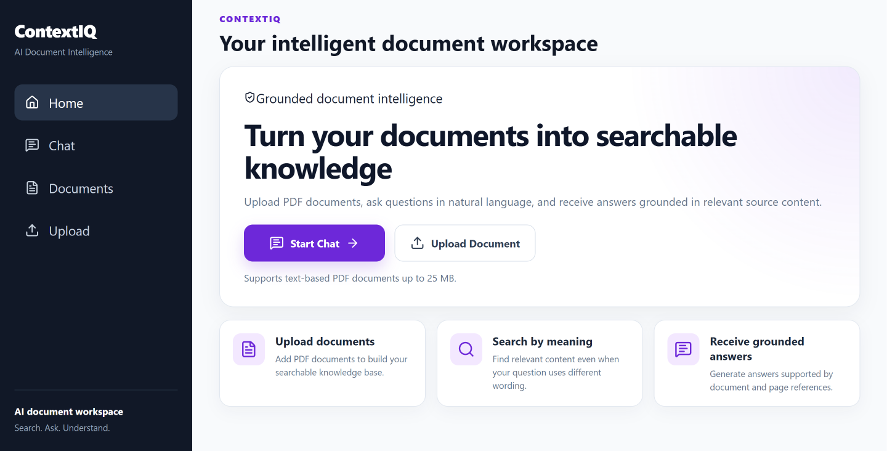
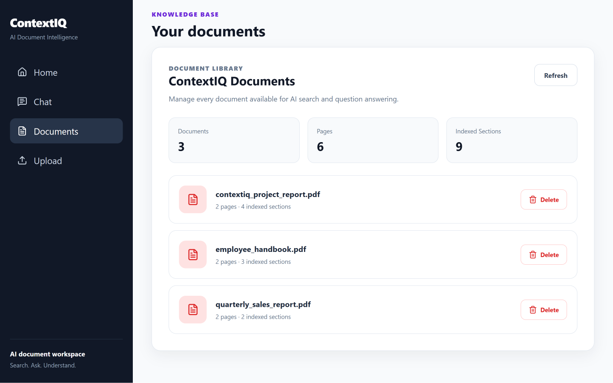
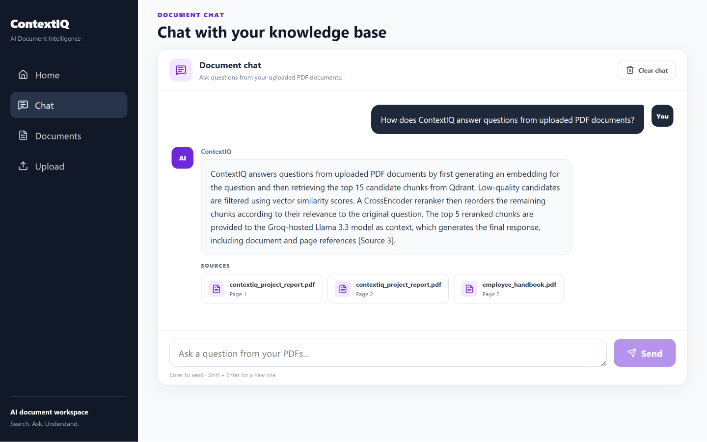

# ContextIQ

### AI-Powered Document Intelligence Platform using Retrieval-Augmented Generation (RAG)

ContextIQ is a modern document question-answering application that enables users to upload PDF documents, retrieve relevant information using semantic search, and generate grounded AI responses with document and page references.

**React • FastAPI • Groq • Qdrant • Sentence Transformers • CrossEncoder**

---

## 📸 Application Preview

### 🏠 Home



---

### 📚 Document Management



---

### 💬 AI Document Chat



---

## Key Features

- Upload and process text-based PDF documents up to 25 MB.
- Extract page-wise text using PyMuPDF and split it into overlapping chunks.
- Generate semantic embeddings for efficient document retrieval using Sentence Transformers.
- Store document embeddings and metadata in Qdrant for semantic search.
- Retrieve relevant document chunks using semantic vector search.
- Improve retrieval quality with CrossEncoder reranking.
- Generate grounded answers using Groq-hosted Llama 3.3.
- Display source documents and page references with each response.
- View, refresh, and delete indexed documents through the React interface.

## RAG Architecture

```text
PDF Upload
    |
    v
Text Extraction with PyMuPDF
    |
    v
Recursive Text Chunking
    |
    v
Sentence Transformer Embeddings
    |
    v
Qdrant Vector Database
    |
    v
User Question
    |
    v
Semantic Retrieval - Top 15 Candidates
    |
    v
Vector Score Filtering
    |
    v
CrossEncoder Reranking
    |
    v
Top 5 Relevant Chunks
    |
    v
Groq Llama 3.3
    |
    v
Grounded Answer with Sources
```

## Tech Stack

| Category | Technologies |
|----------|--------------|
| Frontend | React, Vite, Axios, CSS |
| Backend | FastAPI, Uvicorn |
| AI Concepts | Retrieval-Augmented Generation (RAG), Prompt Engineering |
| Embeddings | Sentence Transformers (all-MiniLM-L6-v2) |
| Vector Database | Qdrant |
| Reranking | CrossEncoder |
| LLM | Groq (Llama 3.3 70B Versatile) |
| PDF Processing | PyMuPDF |

## Core AI Concepts

- Retrieval-Augmented Generation (RAG)
- Semantic Search
- Vector Embeddings
- Vector Databases
- CrossEncoder Reranking
- Prompt Engineering
- Grounded AI Responses

## Project Structure

```text
contextiq/
│
├── backend
│   ├── app
│   │   ├── routes
│   │   ├── services
│   │   ├── config.py
│   │   ├── main.py
│   │   └── schemas.py
│   ├── requirements.txt
│   └── .env.example
│
├── frontend
│   ├── public
│   ├── src
│   │   ├── components
│   │   ├── pages
│   │   ├── styles
│   │   ├── api.js
│   │   ├── App.jsx
│   │   └── main.jsx
│   ├── package.json
│   └── .env.example
│
├── screenshots
│
└── README.md
```

## Use Cases

- Ask questions about company policies and reports
- Search information across long PDF documents
- Retrieve accurate answers with source references
- Explore Retrieval-Augmented Generation (RAG) workflows

## Installation

### 1. Clone the Repository

```bash
git clone https://github.com/your-username/contextiq.git

cd contextiq
```

### 2. Backend Setup

```bash
cd backend

python -m venv venv

# Windows
venv\Scripts\activate

# macOS/Linux
source venv/bin/activate

pip install -r requirements.txt
```

### 3. Frontend Setup

```bash
cd ../frontend

npm install
```

### 4. Configure Environment Variables

Create a `.env` file inside both the `backend` and `frontend` folders using the provided `.env.example` files.

### 5. Start the Backend

```bash
uvicorn app.main:app --reload
```

### 6. Start the Frontend

```bash
npm run dev
```

Open your browser and visit:

```text
http://localhost:5173
```

## Environment Variables

### Backend

Create a `.env` file inside the `backend` folder.

```env
QDRANT_URL=your_qdrant_cluster_url
QDRANT_API_KEY=your_qdrant_api_key
QDRANT_COLLECTION_NAME=knowledge_documents

GROQ_API_KEY=your_groq_api_key
GROQ_MODEL=llama-3.3-70b-versatile
```

### Frontend

Create a `.env` file inside the `frontend` folder.

```env
VITE_API_BASE_URL=http://127.0.0.1:8000
```

## API Reference

| Method | Endpoint | Description |
|---------|----------|-------------|
| POST | `/documents/upload` | Upload and index a PDF document |
| GET | `/documents` | Retrieve all indexed documents |
| DELETE | `/documents/{document_id}` | Delete a document from the vector database |
| POST | `/chat/ask` | Ask questions about uploaded documents |

## Deployment

The application can be deployed using the following services:

| Component | Platform |
|----------|----------|
| Frontend | Vercel |
| Backend | Render |
| Vector Database | Qdrant Cloud |
| LLM | Groq API |

## License

This project was developed for learning and portfolio purposes.